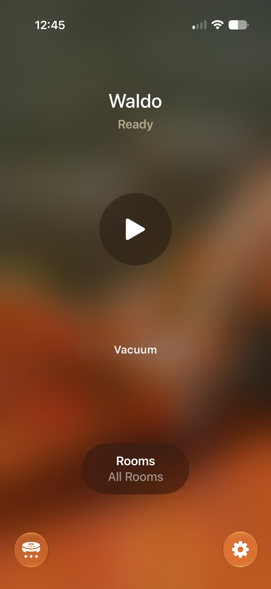
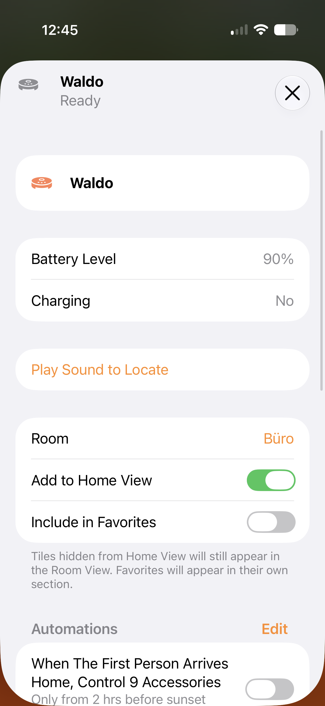
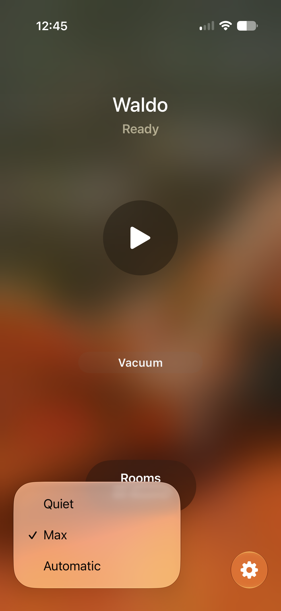
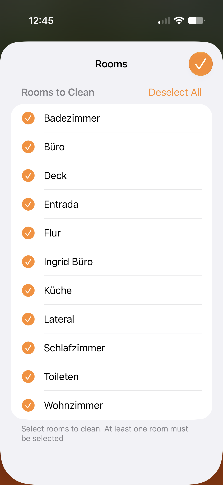
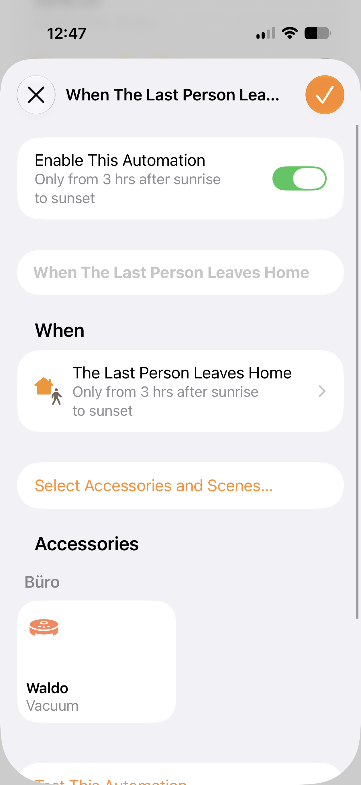

# homebridge-aeg-robot-matter

<p align="center">
  
</p>

<div align="center">

# homebridge-aeg-robot-matter

[](https://www.npmjs.com/package/homebridge-aeg-robot-matter)
[](https://www.npmjs.com/package/homebridge-aeg-robot-matter)

Homebridge plugin for **AEG RX9** and **Electrolux Pure i9** robot vacuums.

Supports both **HomeKit (HAP)** and **Matter Robotic Vacuum Cleaner (RVC)**.

</div>

> This project is an independent Homebridge adaptation inspired by the original `matterbridge-aeg-robot` project by Alexander Thoukydides, extending the original concepts to support both HomeKit and Matter within Homebridge.

<p align="center">
  
</p>

---

## Highlights

- HomeKit Switch accessory support
- Matter Robotic Vacuum Cleaner (RVC) support
- Room selection support
- Cleaning mode selection
- Battery and charging status
- HomeKit automations
- Siri support
- Multiple robot support

---

## Screenshots

### Apple Home Integration

<p align="center">
  
  
  
</p>

### Matter Robotic Vacuum Cleaner

<p align="center">
  
  
</p>

### HomeKit Automations

<p align="center">
  
</p>

---

## Features

### HomeKit (HAP)

- Start cleaning
- Pause cleaning
- Stop cleaning
- Return to charging dock
- Battery level reporting
- Charging status
- Error reporting
- Siri and HomeKit automation support

### Matter Robotic Vacuum Cleaner (RVC)

- Start cleaning
- Pause
- Resume
- Return to dock
- Room selection
- Cleaning mode selection
- Operational state reporting
- Battery reporting
- Charging state reporting
- Matter RVC cluster support
## Accessory Modes

The plugin can expose robot vacuums in different ways depending on your HomeKit and Matter setup.

### HomeKit Switch

A simple and highly compatible HomeKit accessory.

Features:

- Start cleaning
- Stop, pause, or dock when switched off
- Compatible with older HomeKit setups
- Ideal for automations that only need basic cleaning control

```json
{
  "exposeMode": "switch"
}
```

### Matter Robotic Vacuum Cleaner (RVC)

Exposes the vacuum using the Matter Robotic Vacuum Cleaner device type.

Features:

- Native vacuum controls
- Cleaning modes
- Room selection
- Operational state reporting
- Battery status
- Docking controls
- Better integration with recent Apple Home versions

```json
{
  "exposeMode": "matter-rvc"
}
```

### Both

Expose both accessories simultaneously.

This is useful when migrating from HomeKit Switch mode to Matter RVC or when compatibility with existing automations is required.

```json
{
  "exposeMode": "both"
}
```

### Auto

Automatically selects the recommended mode for your Homebridge environment.

```json
{
  "exposeMode": "auto"
}
```
---

## Supported Models

Tested with:

- AEG RX9
- AEG RX9.2
- Electrolux Pure i9

Other variants may work but have not been explicitly tested.

---

## Installation

### Step 1 - Create an Electrolux Account

1. Install the AEG or Electrolux mobile application.
2. Create an account.
3. Add and configure your robot vacuum.

### Step 2 - Obtain API Credentials

1. Log in to https://developer.electrolux.one
2. Create an API Key.
3. Generate:
   - Access Token
   - Refresh Token

### Step 3 - Install the Plugin

Using Homebridge UI:

1. Open Homebridge Config UI X.
2. Search for `homebridge-aeg-robot-matter`.
3. Install the plugin.
4. Configure your credentials.
5. Restart Homebridge.

Or manually:

```bash
npm install -g homebridge-aeg-robot-matter
```

---

## Configuration

```json
{
  "platform": "AEGRobotMatter",
  "name": "AEG Robot",
  "apiKey": "YOUR_ELECTROLUX_API_KEY",
  "accessToken": "",
  "refreshToken": "",
  "exposeMode": "auto",
  "switchOffAction": "dock",
  "pollIntervalSeconds": 30
}
```

---

## Configuration Options

| Option | Default | Description |
|----------|----------|----------|
| `apiKey` | Required | Electrolux API Key |
| `accessToken` | `""` | Initial access token |
| `refreshToken` | `""` | Initial refresh token |
| `accessTokenURL` | Not set | Optional external token provider |
| `exposeMode` | `auto` | `auto`, `switch`, `matter-rvc`, or `both` |
| `switchOffAction` | `dock` | `dock`, `pause`, or `stop` |
| `pollIntervalSeconds` | `30` | API polling interval |
| `whiteList` | `[]` | Serial numbers to include |
| `blackList` | `[]` | Serial numbers to exclude |

---

## Matter Support

The plugin exposes Matter-compatible robotic vacuum functionality including:

- RVC Run Mode
- RVC Operational State
- Power Source
- RVC Clean Mode
- Service Area / Room Selection

Supported operations include:

- Start cleaning
- Pause
- Resume
- Return to dock
- Room cleaning
- Battery monitoring
- Charging status
- Error reporting

---

## Apple Home Notes

Apple Home currently has some limitations regarding Matter robotic vacuum cleaners.

Depending on the Home app version, cleaning modes may be displayed using generic Apple labels rather than the mode names reported by the robot.

This is a Home app limitation and does not affect operation.
## Apple Home Experience

The Matter Robotic Vacuum Cleaner implementation has been tested with:

- iOS 27 Developer Beta
- tvOS 27 Developer Beta

In testing, Apple Home support for Matter robotic vacuum cleaners is noticeably improved on iOS 27 and tvOS 27 compared to iOS 26.5.

Observed improvements include:

- More reliable device connectivity
- Faster state updates
- Better responsiveness when issuing commands
- Fewer instances of accessories becoming temporarily unavailable

While the plugin works on iOS 26.5, occasional connection and responsiveness issues were observed in Apple Home. These issues appear to be significantly reduced when using iOS 27 and tvOS 27.

As Matter support for robotic vacuum cleaners continues to evolve, the best user experience is currently achieved using the latest Apple platform releases.

---

## Compatibility

Tested with:

- Homebridge 2.x
- Apple Home
- HomePod
- Apple TV
- iPhone
- iPad

Matter support requires a Matter-compatible Home Hub.

---

## API Rate Limits

The Electrolux API enforces daily request limits.

The default polling interval of 30 seconds is suitable for a single robot vacuum. If multiple robots share the same API key, consider increasing the polling interval.

---

## Development

```bash
npm install
npm run build
```

---

## Reporting Issues

Please open issues at:

https://github.com/Niklas31/homebridge-aeg-robot-matter/issues

---

## Credits

This project would not exist without the original work by **Alexander Thoukydides**, author of:

https://github.com/thoukydides/matterbridge-aeg-robot

The Homebridge implementation adapts and extends concepts, API integrations, and Matter robotic vacuum functionality from the original Matterbridge project.

Additional development, Homebridge integration, Matter support, maintenance, testing, and documentation were performed by **Nicolas Lehmann**.

AI-assisted development tools, including **OpenAI Codex** and **Google Gemini**, were used during development to assist with code generation, refactoring, debugging, documentation, and migration of functionality between platforms.

Special thanks to:

- Alexander Thoukydides
- Matterbridge
- Homebridge
- Matter.js contributors

---

## Legal

AEG, Electrolux, and Zanussi are trademarks of AB Electrolux.

This project is not affiliated with, endorsed by, or sponsored by AB Electrolux.

---

## License

ISC License
